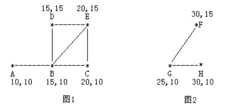

# <font color="bb000">牛的旅行—论述R2未必大于等于R1</font>
## **`下面的链接是——————我做的所有的题解`**

# [包括基础提高以及一些零散刷的各种各样的题](https://www.acwing.com/blog/content/33005/) 

## 题目介绍

农民John的农场里有很多牧区，有的路径连接一些特定的牧区。

一片所有连通的牧区称为一个牧场。

但是就目前而言，你能看到至少有两个牧区不连通。

现在，John想在农场里添加一条路径（注意，恰好一条）。

一个牧场的直径就是牧场中最远的两个牧区的距离（本题中所提到的所有距离指的都是最短的距离）。

考虑如下的两个牧场，每一个牧区都有自己的坐标：

 

 图 1 是有 5 个牧区的牧场，牧区用“*”表示，路径用直线表示。

图 1 所示的牧场的直径大约是 12.07106, 最远的两个牧区是 A 和 E，它们之间的最短路径是 A-B-E。

图 2 是另一个牧场。

这两个牧场都在John的农场上。

John将会在两个牧场中各选一个牧区，然后用一条路径连起来，使得连通后这个新的更大的牧场有最小的直径。

注意，如果两条路径中途相交，我们不认为它们是连通的。

只有两条路径在同一个牧区相交，我们才认为它们是连通的。

现在请你编程找出一条连接两个不同牧场的路径，使得连上这条路径后，所有牧场（生成的新牧场和原有牧场）中直径最大的牧场的直径尽可能小。

输出这个直径最小可能值。

**输入格式**

第 1 行：一个整数 N, 表示牧区数；

第 2 到 N+1 行：每行两个整数 X,Y， 表示 N 个牧区的坐标。每个牧区的坐标都是不一样的。

第 N+2 行到第 2*N+1 行：每行包括 N 个数字 ( 0或1 ) 表示一个对称邻接矩阵。

例如，题目描述中的两个牧场的矩阵描述如下：

```java
  A B C D E F G H 
A 0 1 0 0 0 0 0 0 
B 1 0 1 1 1 0 0 0 
C 0 1 0 0 1 0 0 0 
D 0 1 0 0 1 0 0 0 
E 0 1 1 1 0 0 0 0 
F 0 0 0 0 0 0 1 0 
G 0 0 0 0 0 1 0 1 
H 0 0 0 0 0 0 1 0
```
输入数据中至少包括两个不连通的牧区。

**输出格式**

每组数据输出一个结果，每个结果占一行。

数据保证结果不超过 10 ^ 9。

**数据范围**

```java
1 ≤ N ≤ 150
 
0 ≤ X, Y ≤ 10 ^ 5
```

**输入样例：**

```java
8
10 10
15 10
20 10
15 15
20 15
30 15
25 10
30 10
01000000
10111000
01001000
01001000
01110000
00000010
00000101
00000010
```

**输出样例：**

```java
22.071068
```

----------

一般ACM或者笔试题的时间限制是1秒或2秒。在这种情况下，代码中的操作次数控制在 `10 ^ 7 ∼ 10 ^ 8` 为最佳。

`n <= 100` -> `O(n ^ 3)` -> 状态压缩dp floyd 高斯消元

`n <= 1000` -> `O(n ^ 2)` `O(n ^ 2 * log(n))` -> dp，二分，朴素版Dijkstra、朴素版Prim、Bellman-Ford

`n ≤ 100000`  -> `O(nlogn)` -> 各种sort，线段树、树状数组、set/map、heap、拓扑排序、dijkstra+heap、prim+heap、Kruskal、spfa

## [我的SPFA全题解](https://www.acwing.com/solution/content/184825/) 

##  [我的Dijkstra全题解](https://www.acwing.com/solution/content/184816/) 

## [我的Bellman_fold全题解](https://www.acwing.com/solution/content/189425/)

## [我的Floyd全题解](https://www.acwing.com/solution/content/189426/)


## 解析

这道题，首先我们要明确我们没必要给坐标的每个点开数组，很显然，因为点数远小于范围数，且给的邻接矩阵也是按照输入的节点的顺序给的逻辑边，我们只需要写一个函数能计算两者的距离即可。

## 关键提取信息

其次，我们需要明确，题目保证只有两个连通块，对于两个连通块，我们如果连一条边，而对于各个连通块内部的点之间的距离不会因为连了这条边而发生变化。

## 找寻直径

那么如果我们枚举两个连通块连接的两个点，且知道这两个点对应自己连通块的最大距离，只需要加上两者的距离，就是连接之后最远的两个点距离了，即直径。

为了求最小的直径，我们找寻最小的上述推导值，即可。

## 为什么要r1 和 r2 求最小值？ 根据直觉不应该 `r2` 必然大于等于 `r1`？

其实是存在连接之后的直径还是原来连通块直径长度的情况的。

这里给出一组数据，大家可以好好想想

```java
连通块1 ： A(1, 0) B(1, 5) C(1, 15)

连通块2 ： D(2, 5)
```

显然，对于第一个连通块，来说最远的距离是`AB + BC`-> `15`

对于第二个连通块，是 `0` 

此时 `r1 = 15`

而如果根据我们求`r2`的思路，为了求得最小得直径，连边的情况显然应该是 `B -> D` 得到最小的`r2`，此时`r2 = 0 + 10 = 10`

答案出乎意料，居然小于 `r1` 

如果我们求最大值，可以做到想当然的`C -> D`，使得`A - > D`的`r2`必然大于等于`r1`，但是求最小就会优先考虑连同的那个边是直径的最小情况，这种情况会出现出现把并非直径的情况考虑到`r2`的更新去


### 即其实我们求`r2`的做法无法保证一定能做到`r2`大于`r1`，因此需要综合判断


----------

## java
```java
import java.io.BufferedReader;
import java.io.IOException;
import java.io.InputStreamReader;
import java.util.Arrays;


/**
 * @author Fanxy
 */
public class Main {
    static final double INF = 1e20;
    static double r1, r2 = INF;
    static int N = 160;
    static int n;

    static class Node {
        int x, y;

        public Node(int x, int y) {
            this.x = x;
            this.y = y;
        }
    }

    static Node[] q = new Node[N];
    static int[][] g = new int[N][N];
    static double[][] dist = new double[N][N];
    static double[] maxDist = new double[N];

    static double getDistance(int i, int j) {
        int dx = q[i].x - q[j].x;
        int dy = q[i].y - q[j].y;
        return Math.sqrt(dx * dx + dy * dy);
    }

    static BufferedReader br = new BufferedReader(new InputStreamReader(System.in));

    public static void main(String[] args) throws IOException {
        n = Integer.parseInt(br.readLine());
        for (int i = 0; i < n; i++) {
            String[] s1 = br.readLine().split(" ");
            int x = Integer.parseInt(s1[0]);
            int y = Integer.parseInt(s1[1]);
            q[i] = new Node(x, y);
        }
        for (int i = 0; i < n; i++) {
            String[] s2 = br.readLine().split("");
            for (int j = 0; j < n; j++) g[i][j] = Integer.parseInt(s2[j]);
        }
        for (int i = 0; i < n; i++) {
            for (int j = 0; j < n; j++) {
                if (i != j) {
                    if (g[i][j] == 1) dist[i][j] = getDistance(i, j);
                    else dist[i][j] = INF;
                }
            }
        }
        for (int k = 0; k < n; k++) {
            for (int i = 0; i < n; i++) {
                for (int j = 0; j < n; j++) {
                    dist[i][j] = Math.min(dist[i][j], dist[i][k] + dist[k][j]);
                }
            }
        }
        for (int i = 0; i < n; i++) {
            for (int j = 0; j < n; j++) {
                if (dist[i][j] < INF){
                    maxDist[i] = Math.max(maxDist[i], dist[i][j]);
                    r1 = Math.max(r1, maxDist[i]);
                }
            }
        }
        for (int i = 0; i < n; i++) {
            for (int j = 0; j < n; j++) {
                if (dist[i][j] >= INF)
                    r2 = Math.min(r2, getDistance(i, j) + maxDist[i] + maxDist[j]);
            }
        }
        System.out.printf("%.6f", Math.max(r1, r2));
    }
}
```