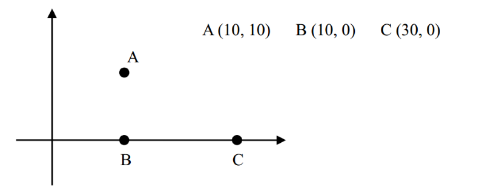

# <font color='bb000'>北极通讯网络【kruskal】-连通块的数量</font>
## **`下面的链接是——————我做的所有的题解`**

# [包括基础提高以及一些零散刷的各种各样的题](https://www.acwing.com/blog/content/33005/) 

## 题目介绍

北极的某区域共有 n 座村庄，每座村庄的坐标用一对整数 (x,y) 表示。

为了加强联系，决定在村庄之间建立通讯网络，使每两座村庄之间都可以直接或间接通讯。

通讯工具可以是无线电收发机，也可以是卫星设备。

无线电收发机有多种不同型号，不同型号的无线电收发机有一个不同的参数 d，两座村庄之间的距离如果不超过 d，就可以用该型号的无线电收发机直接通讯，d 值越大的型号价格越贵。现在要先选择某一种型号的无线电收发机，然后统一给所有村庄配备，数量不限，但型号都是相同的。

配备卫星设备的两座村庄无论相距多远都可以直接通讯，但卫星设备是 有限的，只能给一部分村庄配备。

现在有 k 台卫星设备，请你编一个程序，计算出应该如何分配这 k 台卫星设备，才能使所配备的无线电收发机的 d 值最小。

例如，对于下面三座村庄：

  

其中，|AB|=10,|BC|=20,|AC|=105√≈22.36。

如果没有任何卫星设备或只有 1 台卫星设备 (k=0 或 k=1)，则满足条件的最小的 d=20，因为 A 和 B，B 和 C 可以用无线电直接通讯；而 A 和 C 可以用 B 中转实现间接通讯 (即消息从 A 传到 B，再从 B 传到 C)；

如果有 2 台卫星设备 (k=2)，则可以把这两台设备分别分配给 B 和 C ，这样最小的 d 可取 10，因为 A 和 B 之间可以用无线电直接通讯；B 和 C 之间可以用卫星直接通讯；A 和 C 可以用 B 中转实现间接通讯。

如果有 3 台卫星设备，则 A,B,C 两两之间都可以直接用卫星通讯，最小的 d 可取 0。

**输入格式**

第一行为由空格隔开的两个整数 n,k;

接下来 n 行，每行两个整数，第 i 行的 xi,yi 表示第 i 座村庄的坐标 (xi,yi)。


**输出格式**

一个实数，表示最小的 d 值，结果保留 2 位小数。

**数据范围**

```java
1 ≤ n ≤ 500
 
0≤ x, y ≤ 10 ^ 4

0 ≤ k ≤ 100
```

**输入样例：**
```java
3 2
10 10
10 0
30 0
```

**输出样例：**

```java
10.00
```

----------

一般ACM或者笔试题的时间限制是1秒或2秒。在这种情况下，代码中的操作次数控制在 `10 ^ 7 ∼ 10 ^ 8` 为最佳。

`n <= 100` -> `O(n ^ 3)` -> 状态压缩dp floyd 高斯消元

`n <= 1000` -> `O(n ^ 2)` `O(n ^ 2 * log(n))` -> dp，二分，朴素版Dijkstra、朴素版Prim、Bellman-Ford

`n ≤ 100000`  -> `O(nlogn)` -> 各种sort，线段树、树状数组、set/map、heap、拓扑排序、dijkstra+heap、prim+heap、Kruskal、spfa

## [我的SPFA全题解](https://www.acwing.com/solution/content/184825/) 

##  [我的Dijkstra全题解](https://www.acwing.com/solution/content/184816/) 

## [我的Bellman_fold全题解](https://www.acwing.com/solution/content/189425/)

## [我的Floyd全题解](https://www.acwing.com/solution/content/189426/)

##  [我的Prim题解](https://www.acwing.com/solution/content/143780/)

##  [我的Kruskal题解](https://www.acwing.com/solution/content/189531/)


## 解析

## 类题分享

## 下面这道题是二分 + 双端队列 写了千字详细推导思路

## [通信线路(最易懂的证明)——【从0推演到−>双端队列二分】](https://www.acwing.com/solution/content/196911/)

这题首先看到有一个 `k` 值的免费情况，立马想到此前做过的 `二分 + dfs` 的题，可以去求满足条件的最小的 `d
`。

## 关键抽象

但是我们看到其实我们实际上还是要求最小生成森林，因为我们要尽可能选取更小的 `d`， 而其中的卫星线路，可以分配给最远的两个连通块。整道题就抽象成，求最小的 `d`，使得连通块的数量满足刚好等于 `k`

## 为什么选kruskal

我们求连通块，当然可以使用`二分和 dfs` ，但是每次二分之后还需要判断一下连通块数量，这样复杂度是嵌套起来很高的，而 `kruskal` 本质借助了并查集，天生就是可以满足获取连通块数量，同时，这道题我们能抽象出来，实际上 `d`越大，连通块的数量应该随之单调递减，当`d`等于最远的两个点的边的时候，此时全部的点都在一个连通块了，这也暗示我们不需要使用二分，只需要按边从小到大顺序枚举，那岂不是天生满足kruskal算法。

### java 

```java
import java.io.*;
import java.util.*;

public class Main {
    
    static final int INF = 0x3f3f3f3f, N = 510, M = N * N / 2;
    static int n, k, cnt;
    static int [] p = new int [N];
    
    static class Node{
        int x, y;
        
        public Node(int x, int y){
            this.x = x;
            this.y = y;
        }
    }
    
    static Node [] nodes = new Node[N];
    
    static class Edge implements Comparable<Edge>{
        int x, y;
        double w;
        
        public Edge(int x, int y, double w){
            this.x = x;
            this.y = y;
            this.w = w;
        }
        
        @Override
        public int compareTo(Edge o){
            return (int) (this.w - o.w);
        }
    }
    
    static Edge [] edges = new Edge[M];
    
    static int find(int x){
        if (p[x] != x) p[x] = find(p[x]);
        return p[x];
    }
    
    static double getEdge(Node a, Node b){
        int dx = a.x - b.x, dy = a.y - b.y;
        return Math.sqrt(dx * dx + dy * dy);
    }
    
    static BufferedReader br = new BufferedReader(new InputStreamReader(System.in)); 
    
    public static void main(String [] args) throws IOException {
        String [] s1 = br.readLine().split(" ");
        n = Integer.parseInt(s1[0]);
        k = Integer.parseInt(s1[1]);
        for (int i = 0; i < n; i++){
            String [] s2 = br.readLine().split(" ");
            int x = Integer.parseInt(s2[0]);
            int y = Integer.parseInt(s2[1]);
            nodes[i] = new Node(x, y);
        }
        // 不计算重边 只算单向
        for (int i = 0; i < n; i ++)
            for (int j = 0; j < i; j++){
                edges[cnt++] = new Edge(i, j, getEdge(nodes[i], nodes[j]));
            }
        // 初始化并查集
        for (int i = 0; i < n; i ++) p[i] = i;
        
        // kruskal
        Arrays.sort(edges, 0, cnt);
        
        double ans = 0;  // 最短的d值
        int res = n; // 连通块个数
        for (int i = 0; i < cnt; i ++){
            
            if (res <= k) break;
            
            int x = find(edges[i].x), y = find(edges[i].y);
            double w = edges[i].w;
            
            if (x != y){
                p[x] = y;
                res --;
                ans = w;
            }
        }
        System.out.printf("%.2f", ans);
    }
}
```