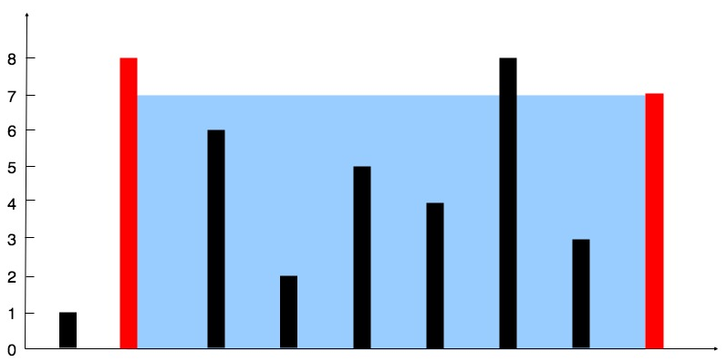

# <font color="bb000">盛最多水的容器【leetcode11 双指针+面积】</font>

## [我的网站=> 分享了我关于前后端的各种知识和生活美食~](https://www.fanxy.icu)

## [我于Acwing平台分享的零散刷的各种各样的题](https://www.acwing.com/blog/content/33005/) 

## 题目介绍

给定一个长度为 `n` 的整数数组 `height` 。有 `n` 条垂线，第 `i` 条线的两个端点是 `(i, 0)` 和 `(i, height[i])` 。

找出其中的两条线，使得它们与 `x` 轴共同构成的容器可以容纳最多的水。

返回容器可以储存的最大水量。

**说明：**你不能倾斜容器。

 

**示例 1：**



```
输入：[1,8,6,2,5,4,8,3,7]
输出：49 
解释：图中垂直线代表输入数组 [1,8,6,2,5,4,8,3,7]。在此情况下，容器能够容纳水（表示为蓝色部分）的最大值为 49。
```

**示例 2：**

```
输入：height = [1,1]
输出：1
```

 

**提示：**

- `n == height.length`
- `2 <= n <= 105`
- `0 <= height[i] <= 104`


### 解析 

这里先说做法，再分析理由。做法即双指针，一个在头一个在尾，比较两个指针对应的高度，把低的那个向中间移动。

根据上面的解析，我们的答案是动态更新的，最远的情况即初始情况，所以肯定能满足一个指针先移动到答案的一条边，假设是左端点。我们思考一个问题，左端点在往右移之前，一定不能出现右端点比它高的情况，才能枚举到答案双边。

**那么能满足此条件吗？**

### 面积取决于高度和宽度

**整个过程，宽度是不断降低的**

**木桶容量由短板决定, 移动长板的话, 水面高度不可能再上升, 而宽度变小了, 所以只有通过移动短板, 才有可能使水位上升。**

**即按照我们的做法，一定能保证水位是尽量上升的，当一边枚举到答案的情况下，因为它是答案，故面积满足最大**

**按照我们的做法，万一当一个指针到达答案的端点，但此时另外一个指针还没到达答案端点，我们的前一个指针被迫先内移动，则此时就因为没有枚举到答案的两个端点更新不到最大值了。那么我们的限制条件能满足避免这种情况吗？**

### 反证法

**这里假设左指针先到达答案的左端点，右端点证明同理，只是方向颠倒**

**出现如上情况，只有可能是右指针指向的端点高度大于左指针指向高度【左指针指向答案的左端点】**

**不可能出现右指针未到达答案右端点【在答案右边】而且此时右指针指向高度比左指针指向的答案左端点更高的情况。假设左指针到达答案的左端点，而右指针目前未到达答案右端点【在答案右边】，此时宽度更大，而水面高度还比左端点大即水面高度更高，面积更大，此时他才应该是答案，矛盾。**

```java
class Solution {
    public int maxArea(int[] height) {
        int res = 0, l = 0, r = height.length-1;
        while (l < r) {
            res = Math.max(res, Math.min(height[l], height[r]) * (r - l));
            if (height[l] > height[r]) r--;
            else l++;
        }
        return res;
    }
}
```


